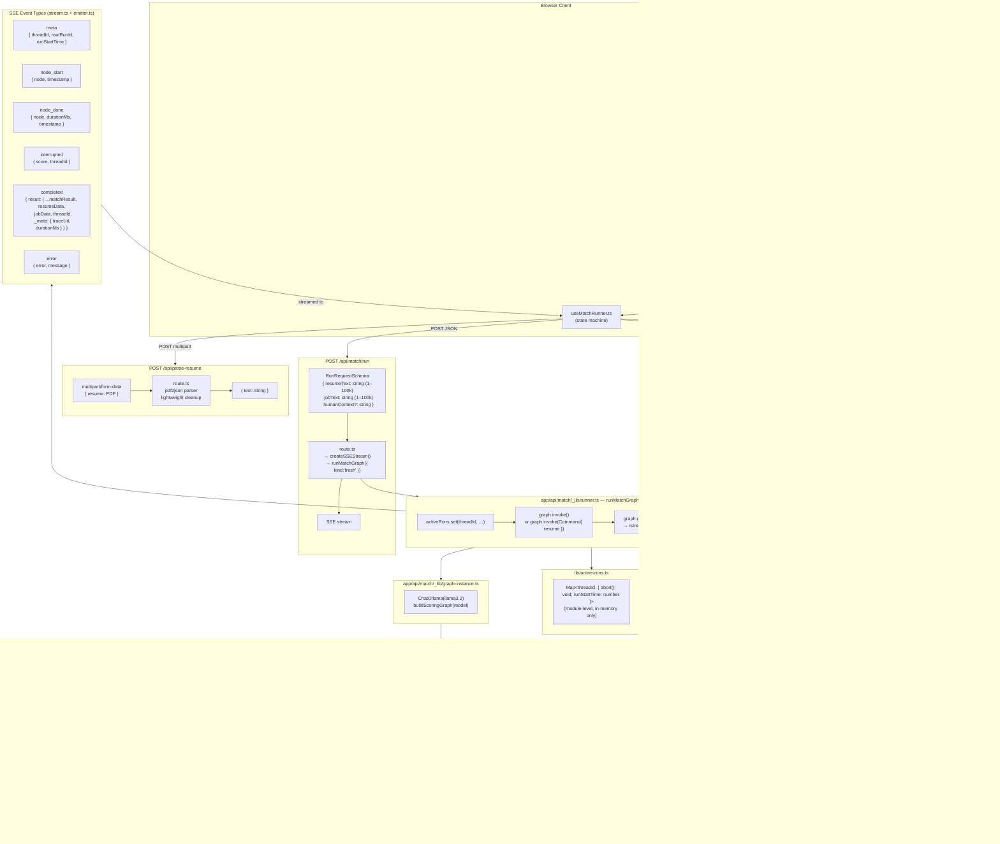

# Architecture Diagram

```mermaid
flowchart TB
    subgraph Client["Browser Client"]
        UI["page.tsx\n(Next.js App Router)"]
        Hook["useMatchRunner.ts\n(state machine)"]
        UI --> Hook
    end

    subgraph ParseRoute["POST /api/parse-resume"]
        PR_IN["multipart/form-data\n{ resume: PDF }"]
        PR_HANDLER["route.ts\npdf2json parser\nlightweight cleanup"]
        PR_OUT["{ text: string }"]
        PR_IN --> PR_HANDLER --> PR_OUT
    end

    subgraph RunRoute["POST /api/match/run"]
        RUN_IN["RunRequestSchema\n{ resumeText: string (1–100k)\n  jobText: string (1–100k)\n  humanContext?: string }"]
        RUN_HANDLER["route.ts\n→ createSSEStream()\n→ runMatchGraph({ kind:'fresh' })"]
        RUN_OUT["SSE stream"]
        RUN_IN --> RUN_HANDLER --> RUN_OUT
    end

    subgraph ResumeRoute["POST /api/match/resume"]
        RES_IN["ResumeRequestSchema\n{ threadId: string (1–10k)\n  humanContext: string }"]
        RES_HANDLER["route.ts\n→ createSSEStream()\n→ runMatchGraph({ kind:'resume' })"]
        RES_OUT["SSE stream"]
        RES_IN --> RES_HANDLER --> RES_OUT
    end

    subgraph CancelRoute["POST /api/match/cancel"]
        CAN_IN["CancelRequestSchema (inline Zod)\n{ threadId: string\n  rootRunId?: string\n  runStartTime?: number }"]
        CAN_HANDLER["route.ts\n→ LangSmith trace update (optional)\n→ activeRuns.get(threadId)\n→ run.abort()"]
        CAN_OUT["{ cancelled: true }"]
        CAN_IN --> CAN_HANDLER --> CAN_OUT
    end

    subgraph ActiveRuns["lib/active-runs.ts"]
        AR["Map&lt;threadId, { abort(): void; runStartTime: number }&gt;\n[module-level, in-memory only]"]
    end

    subgraph Runner["app/api/match/_lib/runner.ts — runMatchGraph()"]
        RNR_SET["activeRuns.set(threadId, …)"]
        RNR_INVOKE["graph.invoke()\nor graph.invoke(Command{ resume })"]
        RNR_SNAP["graph.getState()\n→ isInterrupted?"]
        RNR_DEL["activeRuns.delete(threadId) [finally]"]
        RNR_SET --> RNR_INVOKE --> RNR_SNAP --> RNR_DEL
    end

    subgraph SSEEvents["SSE Event Types (stream.ts + emitter.ts)"]
        E1["meta\n{ threadId, rootRunId, runStartTime }"]
        E2["node_start\n{ node, timestamp }"]
        E3["node_done\n{ node, durationMs, timestamp }"]
        E4["interrupted\n{ score, threadId }"]
        E5["completed\n{ result: { ...matchResult, resumeData,\n  jobData, threadId,\n  _meta: { traceUrl, durationMs } } }"]
        E6["error\n{ error, message }"]
    end

    subgraph GraphInstance["app/api/match/_lib/graph-instance.ts"]
        GI["ChatOllama(llama3.2)\nbuildScoringGraph(model)"]
    end

    subgraph LangGraph["LangGraph Pipeline — buildScoringGraph()"]
        START(("__start__"))
        PARSE_RESUME["parseResume\nreads: resumeText\nwrites: resumeData"]
        PARSE_JOB["parseJob\nreads: jobText\nwrites: jobData"]
        SCORE_MATCH["scoreMatch\nreads: resumeData, jobData, humanContext\nwrites: matchResult"]
        AWAIT_HUMAN["awaitHuman\nLangGraph interrupt()\nwrites: humanContext"]
        RESCORE["rescore\n(same fn as scoreMatch)\nhumanContext now in state"]
        GAP_ANALYSIS["gapAnalysis\nreads: matchResult, resumeData, jobData\nwrites: matchResult"]
        END(("__end__"))

        START -->|parallel| PARSE_RESUME
        START -->|parallel| PARSE_JOB
        PARSE_RESUME --> SCORE_MATCH
        PARSE_JOB --> SCORE_MATCH
        SCORE_MATCH -->|score ≥ 60| GAP_ANALYSIS
        SCORE_MATCH -->|score < 60| AWAIT_HUMAN
        AWAIT_HUMAN -->|humanContext present| RESCORE
        AWAIT_HUMAN -->|no humanContext| GAP_ANALYSIS
        RESCORE --> GAP_ANALYSIS
        GAP_ANALYSIS --> END
    end

    subgraph Checkpointer["MemorySaver (ephemeral)"]
        MEM["In-memory checkpoint store\nLost on server restart\nHITL thread state keyed by thread_id"]
    end

    subgraph LangSmith["lib/langsmith.ts (optional tracing)"]
        LS["RootRunCapture callback\nlogValidationFailure()\nclient.updateRun() on cancel"]
    end

    Hook -->|POST multipart| ParseRoute
    Hook -->|POST JSON| RunRoute
    Hook -->|POST JSON| ResumeRoute
    Hook -->|POST JSON fire-and-forget| CancelRoute

    RUN_HANDLER --> Runner
    RES_HANDLER --> Runner
    Runner --> GraphInstance
    GraphInstance --> LangGraph
    LangGraph --> Checkpointer

    Runner --> SSEEvents
    SSEEvents -->|streamed to| Hook

    Runner --> ActiveRuns
    CAN_HANDLER --> ActiveRuns
    Runner --> LangSmith
    CAN_HANDLER --> LangSmith
```
